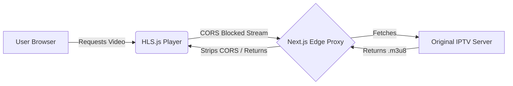

<div align="center">
  <div style="background-color: #FF5A26; width: 60px; height: 60px; border-radius: 50%; display: flex; justify-content: center; align-items: center; margin: 0 auto 20px;">
    <svg width="30" height="30" viewBox="0 0 24 24" fill="none" stroke="white" stroke-width="2" stroke-linecap="round" stroke-linejoin="round"><rect width="20" height="15" x="2" y="7" rx="2" ry="2"/><polyline points="17 2 12 7 7 2"/></svg>
  </div>
  
  # LiveTV 📺

  **A Premium Next.js IPTV Player with Edge Runtime CORS Proxy & HLS Streaming**

  [](https://nextjs.org/)
  [](https://tailwindcss.com/)
  [](https://github.com/video-dev/hls.js)
  [](https://react.dev/)
</div>

<br />

Welcome to **LiveTV**, an elegantly designed, highly responsive web application that turns any device into a premium smart TV. By leveraging Next.js API Routes running on Vercel's Edge Network, LiveTV seamlessly bypasses strict CORS policies that plague traditional IPTV streams, delivering an uninterrupted viewing experience.

---

## ✨ Interactive Features

<details>
<summary><b>🎬 Custom HLS Video Player</b> (Click to expand)</summary>
A bespoke video player powered by <code>hls.js</code>, featuring:
<ul>
  <li><b>Smart Live Edge Detection</b>: Calculates buffer latency and alerts you if you fall behind the absolute live edge.</li>
  <li><b>Catch-up Button</b>: A one-click "LIVE" button to instantly sync your stream to real-time.</li>
  <li><b>YouTube-Style Theater Mode</b>: Expand the video player to fill the screen while intelligently collapsing the sidebar.</li>
  <li><b>Native Safari Support</b>: Automatically falls back to native HTML5 video for Apple devices.</li>
</ul>
</details>

<details>
<summary><b>🔥 Intelligent Edge Proxy</b></summary>
Traditional <code>.m3u8</code> streams often block web players using strict CORS headers. LiveTV solves this natively:
<ul>
  <li><b>Serverless Edge Runtime</b>: Routes stream requests through Next.js Edge APIs to strip restrictive headers and attach permissive CORS headers.</li>
  <li><b>SSRF Protection</b>: Hardened regex logic ensures the proxy can only be used for legitimate streaming sources, preventing abuse.</li>
</ul>
</details>

<details>
<summary><b>📱 Dynamic Glassmorphic UI</b></summary>
A pixel-perfect, premium user interface inspired by modern OTT platforms:
<ul>
  <li><b>Live Search Autocomplete</b>: Instantly filters channels with a floating dropdown menu attached directly to the search bar.</li>
  <li><b>Dynamic Welcome Banner</b>: Greets users with an animated hero screen and one-click access to trending channels.</li>
  <li><b>Responsive Architecture</b>: Uses CSS Grid to mathematically guarantee perfect alignment between the video player and the scrollable sidebar on desktop, while elegantly stacking on mobile.</li>
  <li><b>Deep Dark Theme</b>: A stunning <code>#0B0E14</code> (Midnight Slate) background with <code>#FF5A26</code> (Sunset Orange) accents.</li>
</ul>
</details>

---

## 🚀 Quick Start

Get LiveTV up and running locally in under a minute.

### 1. Clone & Install
```bash
# Clone the repository
git clone https://github.com/your-username/LiveTV.git
cd LiveTV

# Install dependencies
npm install
```

### 2. Start the Development Server
```bash
npm run dev
```

### 3. Tune In
Open [http://localhost:3000](http://localhost:3000) in your browser. The app will automatically fetch the latest public Indian IPTV manifests and render the interface.

---

## 🛠 Tech Stack

| Technology | Purpose |
| :--- | :--- |
| **Next.js (App Router)** | Core framework, routing, and Edge API endpoints. |
| **Tailwind CSS** | Premium utility-first styling and animations. |
| **HLS.js** | Handling Apple HTTP Live Streaming natively in browsers. |
| **Lucide React** | Sleek, modern iconography. |

---

## 📡 Architecture Overview



---

## 🎯 Roadmap

- [x] Integrate reliable public IPTV APIs (`iptv-org`)
- [x] Build custom HLS player with Theater Mode
- [x] Implement Edge proxy for CORS evasion
- [x] Design premium OTT-style interface
- [x] Add real-time Search Autocomplete
- [ ] User Authentication & "Watchlist" support
- [ ] Custom `.m3u8` playlist uploads

<br />

<div align="center">
  <sub>Built with ❤️ for a better streaming experience.</sub>
</div>
